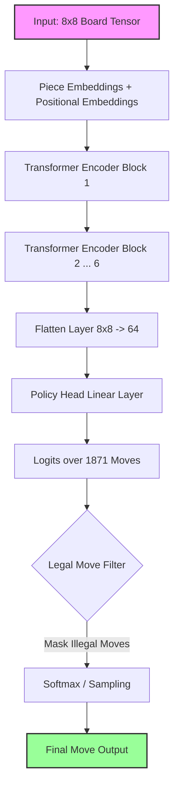

# Chess-ViT: Vision Transformer for Behavioral Cloning in Chess

## 1. Summary

This project implements a **Vision Transformer (ViT)** to play chess. Unlike traditional engines (Stockfish) that rely on hand-crafted evaluation functions and massive search trees, Chess-ViT learns to play purely by **watching human games**.

We treated the chessboard not as a list of rules, but as a **spatial image** (8x8 grid). Using **Behavioral Cloning**, we trained the model to predict the next move made by strong human players (>1500 ELO).

- **Architecture:** Custom ViT with Piece & Positional Embeddings.
- **Dataset:** ~10,000 High-Quality Games (~600k positions).
- **Result:** The model achieved **71.4% Accuracy** in predicting Grandmaster moves.
- **Key Finding:** The model effectively learned **positional concepts** (center control, developing pieces) but lacks **tactical calculation** (capturing free pieces) without an explicit search algorithm.

---

## 2. System Architecture (Paper Diagram)

The model takes a raw board state, processes it through Self-Attention layers to understand relationships between pieces (e.g., pins, attacks), and outputs a probability distribution over all possible moves.

---

## 3. Strengths

### A. Positional Intuition

The model demonstrates a strong understanding of **Human Chess Theory**.

- **Openings:** It plays standard lines (e.g., Sicilian Defense, Ruy Lopez) purely from memory.
- **Center Control:** Attention maps confirm the model focuses heavily on central squares (e4, d4, e5, d5).
- **Piece Activity:** It develops knights and bishops naturally to active squares.

### B. "Vision" Capabilities

By using a Transformer, the model attends to global relationships on the board.

- **Visualization:** Our attention heatmaps show the model "looking" at relevant sectors of the board (e.g., pinning a knight) rather than scanning blindly.
- **Spatial Awareness:** It learned that `e2` is "close" to `e4` through learned embeddings, without hard-coded grid logic.

### C. Training Efficiency

- The model reached **71% accuracy** in just **20 epochs** (~20 minutes on L4 GPU).
- Filtering the dataset to >1500 ELO players drastically improved the quality of play compared to the initial run.

---

## 4. Weaknesses

### A. Tactical Blindness (The "Free Queen" Problem)

This is the most significant limitation. The model relies entirely on **Intuition (Pattern Matching)**, `P(move | board)`.

- It **does not calculate**: "If I take this, he takes that."
- **Result:** It can ignore free material (like a hanging Queen) if taking it looks "weird" or breaks the structural pattern it memorized.
- **Example:** In testing, the bot refused to capture a hanging Queen on `h5` and instead played a defensive pawn move `g6`. While `g6` is structurally sound, `Nxh5` is objectively winning.

### B. Rare Scenarios

- Because the dataset is small (10k games), the model struggles in unique, chaotic positions it has never seen before. It reverts to generic "safe" moves rather than finding the concrete solution.

---

## 5. Conclusion & Future Work

Chess-ViT successfully demonstrates that **Neural Networks can learn the rules and strategy of chess** without explicit programming. It plays a coherent, "human-like" game of chess that feels like a solid Club Player (~1400 ELO) in terms of style.

However, **Intuition is not enough.** To build a superhuman engine (like AlphaZero), we must combine this Neural Network with precise **Calculation**.

**Next Step:** Implement a **1-Ply or 2-Ply Minimax Search**.

- The ViT provides the "Candidate Moves" (Intuition).
- The Search verifies them (Calculation) to catch blunders.
- This hybrid approach would instantly resolve the material blunder issues and elevate the bot to a strong competitive level.
